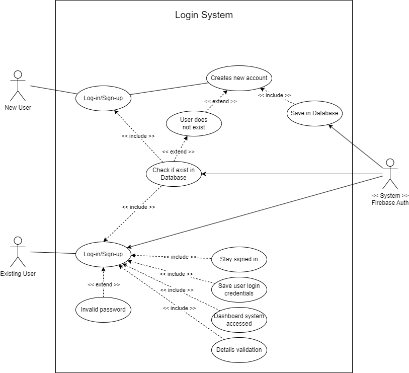
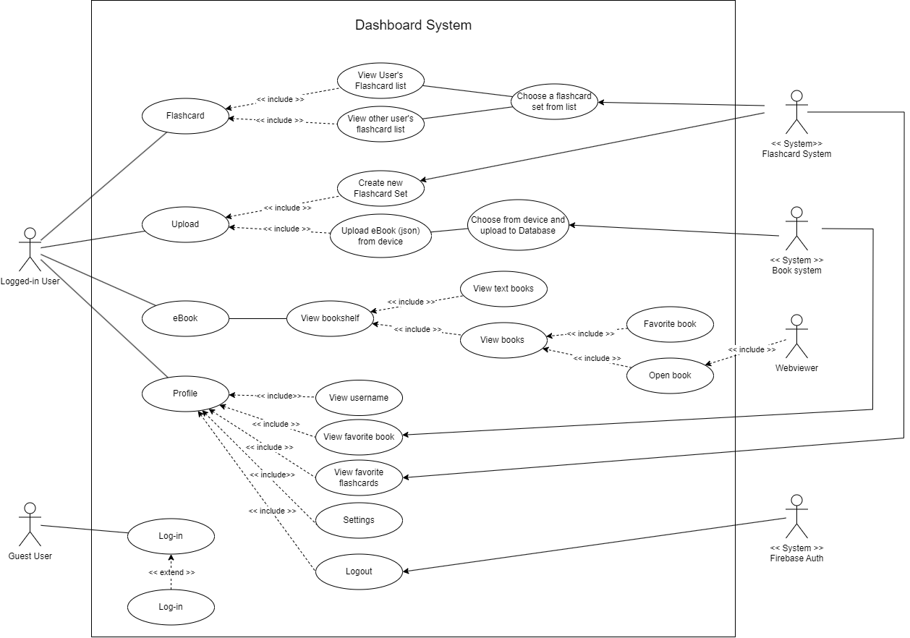
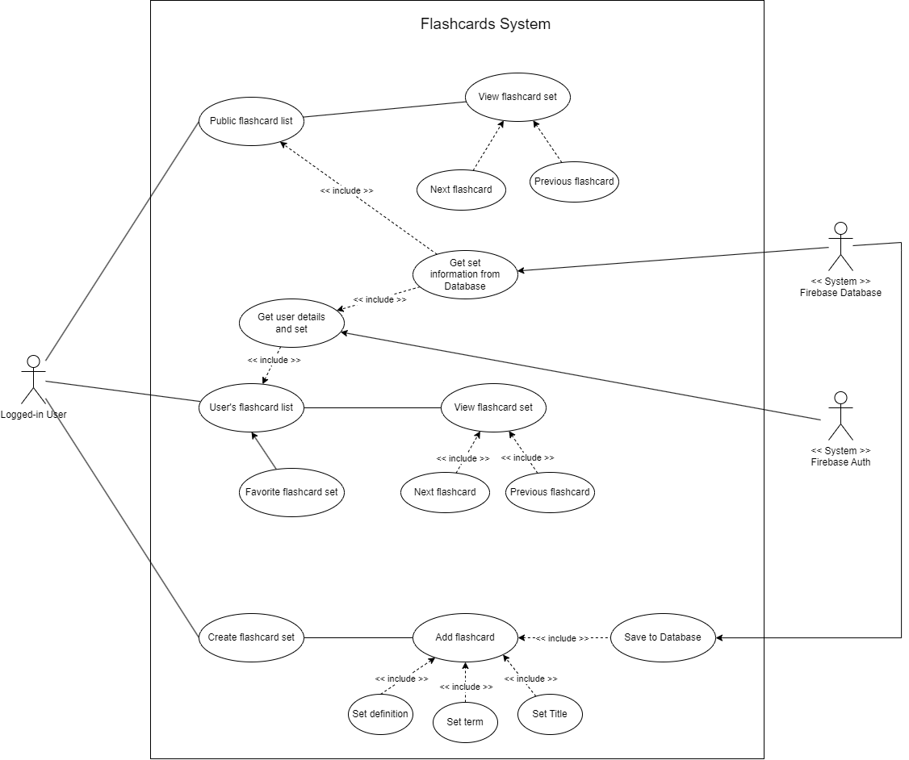
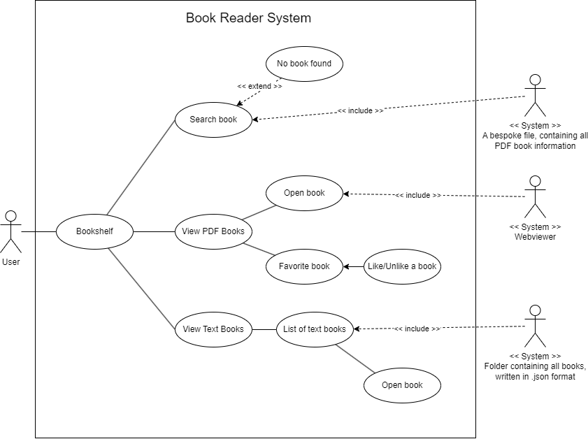

# G06: codeCrushers Report
## Table of Contents

1. [Team Members and Roles](#team-members-and-roles)
2. [Summary of Individual Contributions](#summary-of-individual-contributions)
3. [Application Description](#application-description)
4. [Application UML](#application-uml)
6. [Application Design and Decisions](#application-design-and-decisions)
7. [Summary of Known Errors and Bugs](#summary-of-known-errors-and-bugs)
8. [Testing Summary](#testing-summary)
9. [Implemented Features](#implemented-features)
10. [Team Meetings](#team-meetings)
11. [Communication](#communication)
12. [Conflict Resolution Protocol](#conflict-resolution-protocol)

## Team Members and Roles

| UID      | Name        | App development Role   | Post development Role |
|:---------|:------------|:-----------------------|:----------------------|
| u7453778 | Sunny Zhang | Log-in  & Firebase     | Presentation Video    |
| u7465786 | Mengyao Xu  | eBook & UML            | Presentation Video    |
| u7452980 | Jiaying Li  | GPS feature & Firebase | Presentation Slides   |
| u7487349 | Jiazhe Lin  | Navigation & Search    | Report                |
| u7397058 | Judy Xie    | Flashcards & eBook     | Report                |

## Summary of Individual Contributions
### u7453778 | Sunny Zhang 
Contribution: 19%
1. **Code Implementation**

   a. ***Code Contribution***
   - [Package] Login
     - [Class] [ProfileFragment](https://gitlab.cecs.anu.edu.au/u7397058/ga-23s1-comp2100-6442/-/blob/main/app/src/main/java/com/example/quizzen/login/ProfileFragment.java)
     - [Class] [AuthUtil](https://gitlab.cecs.anu.edu.au/u7397058/ga-23s1-comp2100-6442/-/blob/main/app/src/main/java/com/example/quizzen/login/AuthUtil.java)
     - [Class] [SettingActivity](https://gitlab.cecs.anu.edu.au/u7397058/ga-23s1-comp2100-6442/-/blob/main/app/src/main/java/com/example/quizzen/login/SettingActivity.java)
     - [Class] [SettingFragment](https://gitlab.cecs.anu.edu.au/u7397058/ga-23s1-comp2100-6442/-/blob/main/app/src/main/java/com/example/quizzen/login/SettingFragment.java)
   

   b. ***Feature***
   - [Data-Profile] User profile or Course material activity containing a media file (image, animation (e.g. gif), video). (easy)
   
   - [FB-Auth] Use Firebase to implement User Authentication/Authorisation. (easy)
    
2. **Code Design**
    
   - [Factory design pattern] ProfileFragment utilized the design pattern of factory method, and in the ProfileFragment class provides a uniform  way to create ProfileFragment instances, encapsulates the object creation logic, and provides extensibility. 

   - [Objects]ProfileFragment utilized ``Objects.requireNonNull<>``, you can use this method to ensure that arguments are not null to avoid null pointer exceptions.

   - [Arrays]ProfileFragment utilized ``Arrays.fill<>``, which you can use to set all the elements of an array to specified values.
    

3. **UI Design**
   - Profile page[(fragment_profile)](https://gitlab.cecs.anu.edu.au/u7397058/ga-23s1-comp2100-6442/-/blob/main/app/src/main/res/layout/fragment_profile.xml)
   - Setting Page [(activity_setting)](https://gitlab.cecs.anu.edu.au/u7397058/ga-23s1-comp2100-6442/-/blob/main/app/src/main/res/layout/activity_setting.xml)
   - Setting's root preference[(root_preference)](https://gitlab.cecs.anu.edu.au/u7397058/ga-23s1-comp2100-6442/-/blob/main/app/src/main/res/xml/root_preference.xml)
   - Setting's Mode colour change light[(style_color)](https://gitlab.cecs.anu.edu.au/u7397058/ga-23s1-comp2100-6442/-/blob/main/app/src/main/res/values/themes.xml)
   - Setting's Mode colour change dark[(stly_color(night))](https://gitlab.cecs.anu.edu.au/u7397058/ga-23s1-comp2100-6442/-/blob/main/app/src/main/res/values-night/themes.xml)

4. **Presentation**
   - wrote a script for video 

### u7465786 | Mengyao Xu
Contribution: 19%
1. **Code Implementation** 

   a. ***Code Contribution***
   - [Package] [E-book]()
     - [Class] [BookFragment](https://gitlab.cecs.anu.edu.au/u7397058/ga-23s1-comp2100-6442/-/blob/main/app/src/main/java/com/example/quizzen/navigation/BookFragment.java)
     - [Class] [FavoriteBook](https://gitlab.cecs.anu.edu.au/u7397058/ga-23s1-comp2100-6442/-/blob/main/app/src/main/java/com/example/quizzen/navigation/FavoriteBook.java)

   b. ***Feature***
   - [Interact-Micro] Add favorite to the book

2. **Code Design**
 
The code design of the e-book feature involves creating a favoriteBook class that extends the Fragment class. 
It includes initializing view components such as search view, book covers, and heart icons. Book links are loaded from 
a CSV file using a loadBookLinksFromCsv() method. The toggleHeart() method handles toggling the heart icon. 
Opening a PDF file is achieved through the openPdfFile() method, which utilizes Google Docs viewer. The design ensures 
a seamless user experience in searching for and managing favorite books.
 

3. **UI Design**
   - [fragment_book](https://gitlab.cecs.anu.edu.au/u7397058/ga-23s1-comp2100-6442/-/blob/main/app/src/main/res/layout/fragment_book.xml)
   - [fragment_faborite_book](https://gitlab.cecs.anu.edu.au/u7397058/ga-23s1-comp2100-6442/-/blob/main/app/src/main/res/layout/activity_favorite_book.xml)

4. **Video**
   - [Video edited and voice recorded](https://gitlab.cecs.anu.edu.au/u7397058/ga-23s1-comp2100-6442/-/blob/main/items/QuiZzen.mp4)
   
5. **Other**
   - UML design

### u7452980 | Jiaying Li 
Contribution: 19%
1. **Code Implementation**

   a. ***Code Contribution***
     - [Package] [login](https://gitlab.cecs.anu.edu.au/u7397058/ga-23s1-comp2100-6442/-/tree/main/app/src/main/java/com/example/quizzen/login)
       - [Class] [GPSActivity](https://gitlab.cecs.anu.edu.au/u7397058/ga-23s1-comp2100-6442/-/blob/main/app/src/main/java/com/example/quizzen/login/GPSActivity.java)
       - [Class] [LocaleHelper](https://gitlab.cecs.anu.edu.au/u7397058/ga-23s1-comp2100-6442/-/blob/main/app/src/main/java/com/example/quizzen/login/LocaleHelper.java)
     - [Package] [navigation](https://gitlab.cecs.anu.edu.au/u7397058/ga-23s1-comp2100-6442/-/tree/main/app/src/main/java/com/example/quizzen/navigation)
       - [Class] [BottomNavigationActivity](https://gitlab.cecs.anu.edu.au/u7397058/ga-23s1-comp2100-6442/-/blob/main/app/src/main/java/com/example/quizzen/navigation/BottomNavigationActivity.java)

   b. ***Feature***
   - [Data-GPS] Change the language of the user's location via GPS location.

2. ***Code Design***
   - [Design Pattern] [observer pattern](https://gitlab.cecs.anu.edu.au/u7397058/ga-23s1-comp2100-6442/-/blob/main/app/src/main/java/com/example/quizzen/navigation/BottomNavigationActivity.java#L84-183)

3. **Presentation**
   Completed the slides beautification processing.

### u7487349 | Jiazhe Lin
Contribution: 19%
1. **Code Implementation**
 

   a. ***Code Contribution***
   - [Class] [BottomNavigationActivity](https://gitlab.cecs.anu.edu.au/u7397058/ga-23s1-comp2100-6442/-/blob/main/app/src/main/java/com/example/quizzen/navigation/BottomNavigationActivity.java)
   - [Class] [FlashcardSetAVLNode](https://gitlab.cecs.anu.edu.au/u7397058/ga-23s1-comp2100-6442/-/blob/main/app/src/main/java/com/example/quizzen/flashcards/FlashCardSetAVLNode.java)
   - [Class] [FlashcardSetAVLTree](https://gitlab.cecs.anu.edu.au/u7397058/ga-23s1-comp2100-6442/-/blob/main/app/src/main/java/com/example/quizzen/flashcards/FlashCardSetAVLTree.java)
   - [Class] [FlashcardSearchActivity](https://gitlab.cecs.anu.edu.au/u7397058/ga-23s1-comp2100-6442/-/blob/main/app/src/main/java/com/example/quizzen/flashcards/FlashcardSearchActivity.java)
   - [Class] [Tokenizer](https://gitlab.cecs.anu.edu.au/u7397058/ga-23s1-comp2100-6442/-/blob/main/app/src/main/java/com/example/quizzen/flashcards/Tokenizer.java)

   b. ***Feature***
   - [Search invalid](https://gitlab.cecs.anu.edu.au/u7397058/ga-23s1-comp2100-6442/-/blob/main/app/src/main/java/com/example/quizzen/flashcards/FlashCardSetAVLTree.java#L138-201)

2. **Code Design**
   - [Data Structure] [AVLTree](https://gitlab.cecs.anu.edu.au/u7397058/ga-23s1-comp2100-6442/-/blob/main/app/src/main/java/com/example/quizzen/flashcards/FlashCardSetAVLNode.java)
   - [Tokenizer][Simple Query Tokenizer](https://gitlab.cecs.anu.edu.au/u7397058/ga-23s1-comp2100-6442/-/blob/main/app/src/main/java/com/example/quizzen/flashcards/Tokenizer.java)
   
3. **UI Design**
   - Bottom Navigation Bar [(activity_bottom_navigation)](https://gitlab.cecs.anu.edu.au/u7397058/ga-23s1-comp2100-6442/-/blob/main/app/src/main/res/layout/activity_bottom_navigation.xml)
   - Upload(non-functional) [(fragment_upload)](https://gitlab.cecs.anu.edu.au/u7397058/ga-23s1-comp2100-6442/-/blob/main/app/src/main/res/layout/fragment_upload.xml)

4. **Report Writing**
   - Structured the report
   - Wrote Section 3, 6-12 of report

5. **Presentation**
   - Created the user interaction flowchart and other designs in minute of madness slides.

7. **Other**
   - Attend checkpoint 1 and checkpoint 2

### u7397058 | Judy Xie
Contribution: 24%
1. **Code Implementation**

      a. ***Code Contribution***
      - [Package] flashcards
	    -  [Class] [AddFlashcards](https://gitlab.cecs.anu.edu.au/u7397058/ga-23s1-comp2100-6442/-/blob/main/app/src/main/java/com/example/quizzen/flashcards/AddFlashcards.java)
	    -  [Class] [FlashcardSet](https://gitlab.cecs.anu.edu.au/u7397058/ga-23s1-comp2100-6442/-/blob/main/app/src/main/java/com/example/quizzen/flashcards/AddFlashcards.java)
	    -  [Class] [ViewFlashcard](https://gitlab.cecs.anu.edu.au/u7397058/ga-23s1-comp2100-6442/-/blob/main/app/src/main/java/com/example/quizzen/flashcards/ViewFlashcard.java)
      - [Package] book
      - [Class] [FlashcardsFragment](https://gitlab.cecs.anu.edu.au/u7397058/ga-23s1-comp2100-6442/-/blob/main/app/src/main/java/com/example/quizzen/navigation/FlashcardsFragment.java)
      - [Class] [BookTextFragment](https://gitlab.cecs.anu.edu.au/u7397058/ga-23s1-comp2100-6442/-/blob/main/app/src/main/java/com/example/quizzen/navigation/BookTextFragment.java)

      b. ***Feature***
      - [Data-Formats] Read data instances from multiple local files in JSON and bespoke (Mengyao wrote the one for bespoke)
      - [Interact-Micro] Adding a flashcard set to favorites, stored in Firebase Database
      - [FB-Syn] When a user adds a new flashcard set to the database, the flashcard list is updated without restarting the application

2. **Code Design**

      FlashcardSet utilized a ``List<List<String>>`` design to store its flashcards and other relevant information. 

      ViewFlashcard utilized ``ArrayList<>`` as the class expects a list from the flashcards home screen instance, where a data stream of FlashcardSet is input. Therefore, the class used a dynamic list, where resizing is possible.

      AddFlashcards also utilized a ``List<List<String>>`` to store the list of new flashcards that the user has added.

3. **UI Design**

      Designed and implemented the designs for the list below:

      - Flashcards home screen [(fragment_flashcards)](https://gitlab.cecs.anu.edu.au/-/ide/project/u7397058/ga-23s1-comp2100-6442/tree/main/-/app/src/main/res/layout/activity_add_flashcards.xml/)
      - Add flashcards screen [(activity_add_flashcards)](https://gitlab.cecs.anu.edu.au/-/ide/project/u7397058/ga-23s1-comp2100-6442/tree/main/-/app/src/main/res/layout/activity_add_flashcards.xml/)
      - View flashcards screen [(activity_view_flashcard)](https://gitlab.cecs.anu.edu.au/-/ide/project/u7397058/ga-23s1-comp2100-6442/tree/main/-/app/src/main/res/layout/activity_view_flashcard.xml/)
      - Text-based books list screen [(fragment_book_text)](https://gitlab.cecs.anu.edu.au/-/ide/project/u7397058/ga-23s1-comp2100-6442/tree/main/-/app/src/main/res/layout/fragment_book_text.xml/)
      - Reader for text-based books [(activity_book_read)](https://gitlab.cecs.anu.edu.au/-/ide/project/u7397058/ga-23s1-comp2100-6442/tree/main/-/app/src/main/res/layout/activity_book_read.xml/)

4.  **Report Writing**

      Wrote part 3; some of 6; 7, and 8.

5. **Presentation**

      Wrote the script for minute madness presentation.

## Application Description

### Overview
QuizZen is an educational application that aims to boost students' learning, with the help of built-in flashcards app and ebook reader. Users can choose to design their own flashcard sets, or search for other user's flashcards to use in their learning. QuizZen also comes with an eBook reader, which users can use to browse literature from selected literatres in the bookcase, or choose to view text-based literatures offered by QuizZen's vast database. Anyone who needs to remember and learn information can benefit from QuizZen.
- **Functionalities**:
    1. Flashcard set: 
       1. Flashcard Set Page with search function: [Screenshot 1](./images/1.png)
       2. Flashcard Viewer with shuffle and re-ordering: [Screenshot 2](./images/2.png)
       3. Flashcard Creator: [Screenshot 3](./images/5.png)
    2. Book Reader:
       1. Book Shelf Page: [Screenshot 4](./images/6.png)
       2. Text Book Reader: [Screenshot 5](./images/3.png)
    3. Profile Page: [Screenshot 6](./images/4.png)

### Target Users
- Students
- Teachers
- Individuals who wish to combine active learning with reading

### Use case

 

 

 

 

## Application UML

  

## Application Design and Decisions

### Data Structures
1. **List**

* Objective: Used for storing FlashcardSet data, uploaded to Firebase Database, or read into read flashcards, or used to store Flashcard data in search and loading data to flashcards home page

* Locations: 
  - https://gitlab.cecs.anu.edu.au/u7397058/ga-23s1-comp2100-6442/-/blob/main/app/src/main/java/com/example/quizzen/flashcards/ViewFlashcard.java#L29-31
  - https://gitlab.cecs.anu.edu.au/u7397058/ga-23s1-comp2100-6442/-/blob/main/app/src/main/java/com/example/quizzen/flashcards/ViewFlashcard.java#L52-64
  - https://gitlab.cecs.anu.edu.au/u7397058/ga-23s1-comp2100-6442/-/blob/main/app/src/main/java/com/example/quizzen/flashcards/AddFlashcards.java#L35
  - https://gitlab.cecs.anu.edu.au/u7397058/ga-23s1-comp2100-6442/-/blob/main/app/src/main/java/com/example/quizzen/flashcards/AddFlashcards.java#L85
  - https://gitlab.cecs.anu.edu.au/u7397058/ga-23s1-comp2100-6442/-/blob/main/app/src/main/java/com/example/quizzen/flashcards/AddFlashcards.java#L119-120
  - https://gitlab.cecs.anu.edu.au/u7397058/ga-23s1-comp2100-6442/-/blob/main/app/src/main/java/com/example/quizzen/navigation/FlashcardsFragment.java#L51-53
  - https://gitlab.cecs.anu.edu.au/u7397058/ga-23s1-comp2100-6442/-/blob/main/app/src/main/java/com/example/quizzen/navigation/FlashcardsFragment.java#L206

* Benefits: 
  - A very efficient way of storing data that's in a sequence
  - Can be edited, index accessed, and ordered
  - Easy to store to Firebase Database
 

2. **AVLTree**
* Objective: Used to generate a flashcard AVLTree to allow a dynamic storage and allow search activity
* Location:
  - https://gitlab.cecs.anu.edu.au/u7397058/ga-23s1-comp2100-6442/-/blob/main/app/src/main/java/com/example/quizzen/flashcards/FlashCardSetAVLNode.java
  - https://gitlab.cecs.anu.edu.au/u7397058/ga-23s1-comp2100-6442/-/blob/main/app/src/main/java/com/example/quizzen/flashcards/FlashCardSetAVLTree.java
* Benefits: 
  - Balanced Height: AVL trees are self-balancing binary search trees that maintain a balanced height. This ensures efficient search, insertion, and deletion operations with a worst-case time complexity of O(log n), where n is the number of elements in the tree. In contrast, other structures like unbalanced binary search trees may have a worst-case time complexity of O(n) for certain operations.
  - Guaranteed Height Balance: AVL trees guarantee that the height difference between the left and right subtrees of any node (known as the balance factor) is at most 1. This balance factor ensures that the tree remains balanced, leading to improved performance and stability over time.
  - Fast Operations: Due to the balanced nature of AVL trees, operations like search, insert, and delete have a predictable and efficient time complexity. This makes AVL trees suitable for scenarios where frequent dynamic updates and efficient searching are required.
  - Sorted Order: AVL trees maintain a sorted order of elements based on their keys. This property makes AVL trees useful for applications where sorted traversal, range queries, or ordered data representation are required.

### Design Patterns
1. **Adapter**
* Objective: To adapt FlashcardSet object to string text
* Locations:
  - https://gitlab.cecs.anu.edu.au/u7397058/ga-23s1-comp2100-6442/-/blob/main/app/src/main/java/com/example/quizzen/flashcards/FlashcardSearchActivity.java
* Benefits:  
  - It allows objects with different interfaces to work together.
  - Converts the interface of one class into another that clients expect.
  - Enables integration of existing code with new components or systems.

2. **Factory**
* Objective: Users instance database.
* Locations:
    * https://gitlab.cecs.anu.edu.au/u7397058/ga-23s1-comp2100-6442/-/blob/main/app/src/main/java/com/example/quizzen/login/ProfileFragment.java#L33-62
	
* Benefits:
  - Encapsulates object creation logic, providing a central place for creating objects.
  - Allows for the creation of objects without exposing the instantiation logic to the client.
  - Facilitates code reuse and promotes the principle of "programming to an interface, not an implementation."

3. **Observer**
* Objective: To check whether the IP address of the user is in China and change languages accordingly
* Locations:
  - https://gitlab.cecs.anu.edu.au/u7397058/ga-23s1-comp2100-6442/-/blob/main/app/src/main/java/com/example/quizzen/login/GPSActivity.java
  - https://gitlab.cecs.anu.edu.au/u7397058/ga-23s1-comp2100-6442/-/blob/main/app/src/main/java/com/example/quizzen/navigation/BottomNavigationActivity.java#L106-184
* Benefits:
   - Promotes loose coupling between the subject and its observers, allowing for easy addition or removal of observers without modifying the subject.
   - Provides a flexible and decoupled communication mechanism between objects, enabling a variety of update and notification strategies.
   - Supports event-driven architectures (ie. GPS feature) and facilitates the implementation of reactive systems(ie. language change) .

### Tokenizers and Parsers
1. **Tokenizers**

* Objective: Search text in book page.

* Locations:
	* https://gitlab.cecs.anu.edu.au/u7397058/ga-23s1-comp2100-6442/-/blob/main/app/src/main/java/com/example/quizzen/navigation/BookFragment.java#L107
	* https://gitlab.cecs.anu.edu.au/u7397058/ga-23s1-comp2100-6442/-/blob/main/app/src/main/java/com/example/quizzen/flashcards/Tokenizer.java

* Benefits:
	* To break down string query to manageable tokens such as one word or one character
	* Used for more complex Search objectives
 

2. **Parsers**

* Objective: Parse ``.json`` files' information into readable text, which can then be visualized in text book list and text book reader.

* Locations: 
    * [Parser class](https://gitlab.cecs.anu.edu.au/u7397058/ga-23s1-comp2100-6442/-/blob/main/app/src/main/java/com/example/quizzen/book/Parser.java)
    * [Load JSON titles](https://gitlab.cecs.anu.edu.au/u7397058/ga-23s1-comp2100-6442/-/blob/main/app/src/main/java/com/example/quizzen/navigation/BookTextFragment.java#L67-91)

* Benefits: Since data is stored in JSON format, we would need a way to translate it into readable text for our program. Therefore, we implemented the parser.
* Grammar: 
<pre> 
json       -> "[" bookList "]"
bookList   -> book | book "," bookList
book       -> "{" "title" ":" string "," "author" ":" string "," "id" ":" number "," "favorite" ":" boolean "," "text" ":" string "}"
string     -> (string value)
number     -> (numeric value)
boolean    -> "true" | "false"
</pre>
* Parse Tree: 
<pre>
      json
        |
        |
      bookList
   /     |     \
 book  ','  bookList
  |           |     
  |          book 
  |           |  
 '{'    attributes  '}'
  |           |
  |          ...
  |           |
 '{'    attributes  '}'
  |           |
  |          ...
</pre>
### Storage
1. **Bespoke**
* Objective: Read book lists

* Locations:
  - https://gitlab.cecs.anu.edu.au/u7397058/ga-23s1-comp2100-6442/-/blob/main/app/src/main/java/com/example/quizzen/navigation/BookFragment.java#L185

* Benefits:
  - Optimal Performance: Since bespoke storage is designed specifically for the application's needs (ie. book list), it can optimize performance by efficiently handling data access, retrieval, and storage operations.
  - Scalability: With a bespoke data storage solution, it is easier to scale and adapt as the application or system grows, ensuring efficient handling of increasing data volumes and user demands.
  - Data Security and Compliance: Bespoke storage can be designed with enhanced security measures and compliance requirements in mind, providing better control over data protection, privacy, and regulatory compliance.

2. **Firebase**
* Objective: To store user info and flashcard sets on cloud
* Locations:
   - https://gitlab.cecs.anu.edu.au/u7397058/ga-23s1-comp2100-6442/-/blob/main/app/src/main/java/com/example/quizzen/login/AuthUtil.java
   - https://gitlab.cecs.anu.edu.au/u7397058/ga-23s1-comp2100-6442/-/blob/main/app/src/main/java/com/example/quizzen/flashcards/AddFlashcards.java
* Benefits: 
   - Real-time Updates: Firebase provides real-time synchronization, allowing data changes to be instantly propagated to connected clients. This real-time functionality is particularly useful for applications that require live updates, collaborative features, or instant messaging.
   - Serverless Architecture: Firebase is a serverless platform, meaning you don't have to manage infrastructure or worry about scaling servers. This simplifies development and reduces operational overhead, allowing developers to focus on building the application logic.
   - Built-in Security: Firebase provides built-in security mechanisms, including authentication, user permissions, and data validation rules. These features help ensure data integrity, protect against unauthorized access, and simplify the implementation of secure applications.

### Canceled Functionalities
1. Ebook Reader: 
   * Original Vision: 
      - Allows user to upload pdf document
      - Automatically parse the pdf and generate flashcards using AI tools
   * End Product:
       - A bookshelf that redirect user to a website to download pdf document
       - A text book reader that parses .json files
       - None-functional Upload Page
   * Reasoning: 
       - Too difficult, we have to change directions, so we can have a finished product
       - Not enough time to explore how to use AI tool
2. Dark Mode:
    * Original Vision
      - Our app would have dark mode compatibility with optimal colour swaps
    * Reasoning for cancellation:
      - Not enough time.
    
   

## Summary of Known Errors and Bugs
### Errors

**Login System**

1. **Error in console after log in event**

      a. ***Occurrence***

      After the user has normally logged in, the logcat will display an error, indicating that Firebase failed to find the user information, even though said user exists and had just logged in.

      b. ***Possible reason***
   - Inconsistent Data Synchronization: There might be a delay or inconsistency in data synchronization between the 
   client application and the Firebase server. This can result in the logcat error appearing after the user has logged 
   in, as the server may not have updated the user information at the time of the login verification.
   
      c. ***Consequence***

      No major consequences, as this isn't seen user-side.
 

### Bugs
**Login System**

1. **Clickable login/sign-up button even after user has logged-in**

      a. ***Occurrence***

      After the user has normally logged in, upon clicking the login/sign-up button, now replaced by the user's email, will still direct the user to log-in.

      b. ***Possible reason***

      The button for logging in has not been set to be un-clickable after logging in.

2. **User can click "logout" even before logging in**

      a. ***Occurrence***

      Before the user logs in, they can still click the on "logout" button. Nothing happens though.

      b. ***Possible reason***

      The logout button has not setup a listener to check whether the current user is null

3. **Firebase connectivity issues**

      a. ***Occurrence***

      Sometimes the user can't login due to connectivity issues from Firebase. Upon clicking login, if there's no Firebase connectivity, the application stops.

      b. ***Possible reason***

      Could be a network issue, as users can login again after changing the WiFi.

 

**eBook System**

1. **Changed bookshelf layout upon search**

      a. ***Occurrence***

      If users try to search partially for the eBook name, the bookshelf’s layout would change. The layout shows the unordered books. However once finishing entering the keyterms or closing the search view, the bookshelf returns to normal.

      b. ***Possible reason***

      The placement of books in bookshelves has relative position, and when user clicks the search view, the position is changed, therefore the bookshelf layout changes.

2. **Not disappearing button**

      a. ***Occurrence***

      When users click on “View Text Book” button, the button doesn’t disappear once transferred to the “QuizZen Text Book” fragment, and it’s still clickable.

      b. ***Possible reason***

      The calling of QuizZen Text Book fragment is stacked on top of the fragment it was called on. Because it didn't transfer to another activity or fragment, the button stays visible.

 

**Flashcards System**

1. **Logged out user in profile**

      a. ***Occurrence***

      Creating a flashcard set after logging in, would cause the login page to log out the user, but the Firebase Authentication instance will show that the user is still logged in. The user will still be able to create flashcard sets, interact with the app normally, but they won't be able to see their username in profile.

      b. ***Possible reason***
   - Session Management Conflict: There may be a conflict or inconsistency in session management between the login page 
   and the flashcard set creation process. When the user creates a flashcard set, it triggers a session management action that conflicts with the login session, leading to an unintentional logout of the user.

 

**Settings/Profile**

1. **Device-dependent settings**

      a. ***Occurrence***

      The dark mode and battery saving options may only work if the user has certain phone models. Other times, it may not work.

      b. ***Possible reason***

      The models which can't have the settings turned on might not have support for such systems.

2. **Blank Favorite ebook page**

      a. ***Occurrence***

      When users click on "Favorite eBooks" in profile, it presents the users with a blank page, as opposed to a screen displaying the user's favorite books.

      b. ***Possible reason***

      The calling of favorite book fragment class may be wrong, but we didn't have the time to fix it :(

3. **Can't view favorite flashcards list**

      a. ***Occurrence***

      When users click on "Your favorite flashcards" in profile, the user doesn't get presented with anything. But it's supposed to give a list of favorite flashcards.

      b. ***Possible reason***

      In log, it's indicated that for some reason, Firebase Database has denied read access. Even though the read access is always true, even for anon users.

## Testing Summary

1. **Test Class: BookTest**
- Number of test cases: **10**
- Code coverage: **100%**
- Types of tests created: **Java Unit Test**

2. **Test Class: BookRepositoryTest**
- Number of test cases: **2**
- Code coverage: **N/A**
- Types of tests created: **Android Test**
- Flagged Error: **Null Pointer Error**
   - This error may be the cause of bugs presented in the eBook system

3. **Test Class: ParserTest**
- Number of test cases: **3**
- Code coverage: **N/A**
- Types of tests created: **Android Test**

4. **Test Class: FlashcardAVLNodeTest**
- Number of test cases: **1**
- Code coverage: **100%**
- Types of tests created: **Java Unit Test**

5. **Test Class: FlashcardAVLTreeTest**
- Number of test cases: **12**
- Code coverage: **100%**(Excluding private method in the class)
- Types of tests created: **Java Unit Test**
- Flagged Error: Right and Left rotation result in unexpected outcomes
   - This may due to the original design of the code, given functionality is still achieved.
   - This error also causes the failed pass on the advanced test defined

6. **Test Class: FlashcardSetTest**
- Number of test cases: **5**
- Code coverage: Method: **100%** Line: **92%**
- Types of tests created: **Java Unit Test**

7. **Test Class: TokenizerTest**
- Number of test cases: **1**
- Code coverage: **100%**
- Types of tests created: **Java Unit Test**
   
  
   

### A. Basic App

1. **[Login]** Login/Sign-up system for users (medium)
* [lauchLogin() method](https://gitlab.cecs.anu.edu.au/u7397058/ga-23s1-comp2100-6442/-/blob/main/app/src/main/java/com/example/quizzen/login/ProfileFragment.java#L214-222)
* [loginLauncher](https://gitlab.cecs.anu.edu.au/u7397058/ga-23s1-comp2100-6442/-/blob/main/app/src/main/java/com/example/quizzen/login/ProfileFragment.java#L186-212)

2. **[2,500 Data Instances]** A file containing 2,500 book titles, fed to book list (easy)
* [JSON files containg book titles (no actual content)](https://gitlab.cecs.anu.edu.au/u7397058/ga-23s1-comp2100-6442/-/blob/main/app/src/main/assets/otherbooks.json)

3. **[Data Visualization]** Load data from local and Firebase (medium)
* [JSON book list data visualization](https://gitlab.cecs.anu.edu.au/u7397058/ga-23s1-comp2100-6442/-/blob/main/app/src/main/java/com/example/quizzen/navigation/BookTextFragment.java)
* [Reading flashcards from Firebase](https://gitlab.cecs.anu.edu.au/u7397058/ga-23s1-comp2100-6442/-/blob/main/app/src/main/java/com/example/quizzen/navigation/FlashcardsFragment.java#L174-203)
	* [Visualize the data in a list of flashcard sets](https://gitlab.cecs.anu.edu.au/u7397058/ga-23s1-comp2100-6442/-/blob/main/app/src/main/java/com/example/quizzen/navigation/FlashcardsFragment.java#L212-272)
	* [Read data from a certain flashcard set and display all flashcards](https://gitlab.cecs.anu.edu.au/u7397058/ga-23s1-comp2100-6442/-/blob/main/app/src/main/java/com/example/quizzen/flashcards/ViewFlashcard.java)

4. **[Search]** Search for flashcard set or books (medium)
* [Flashcard search in flashcard homepage](https://gitlab.cecs.anu.edu.au/u7397058/ga-23s1-comp2100-6442/-/blob/main/app/src/main/java/com/example/quizzen/navigation/FlashcardsFragment.java#L102-129)
	* [Searching through flashcard AVL Tree](https://gitlab.cecs.anu.edu.au/u7397058/ga-23s1-comp2100-6442/-/blob/main/app/src/main/java/com/example/quizzen/flashcards/FlashCardSetAVLTree.java#L143-169) 
	* [Tokenizer](https://gitlab.cecs.anu.edu.au/u7397058/ga-23s1-comp2100-6442/-/blob/main/app/src/main/java/com/example/quizzen/flashcards/Tokenizer.java)
* [Book search and search tokenizer in bookshelf](https://gitlab.cecs.anu.edu.au/u7397058/ga-23s1-comp2100-6442/-/blob/main/app/src/main/java/com/example/quizzen/navigation/BookFragment.java#L93-152)

### B. General Features
#### Implemented Features:

*Feature Category: Search*

1. **[Search-Invalid]** Search functionality can handle partially valid and invalid search queries (medium)
   - Links
      * [Flashcard search in flashcard homepage](https://gitlab.cecs.anu.edu.au/u7397058/ga-23s1-comp2100-6442/-/blob/main/app/src/main/java/com/example/quizzen/navigation/FlashcardsFragment.java#L102-129)
      * [Searching through flashcard AVL Tree](https://gitlab.cecs.anu.edu.au/u7397058/ga-23s1-comp2100-6442/-/blob/main/app/src/main/java/com/example/quizzen/flashcards/FlashCardSetAVLTree.java#L143-169) 
      * [Fuzzy search](https://gitlab.cecs.anu.edu.au/u7397058/ga-23s1-comp2100-6442/-/blob/main/app/src/main/java/com/example/quizzen/flashcards/FlashCardSetAVLTree.java#L185-201)
   - Description:
   This Search feature can take in invalid/partially invalid search queries in flashcard search using a fuzzy comparison 
   algorithm that dictates how closely two strings are like each other, and is case-insensitive. Sample valid searches includes: 
      - ca -> Cat
      - DEAR -> Dear
      - ath -> math
   - Limitations
      - Because of the fuzzy compare algorithm used, this search in real life can only deal with "untyped" situation, namely
     forget to spell the front and last character of a word
      - Because of the nature of the search method, it only returns one result that it thinks matches best instead of lists
     of results

*Feature Category: Data Usage, Handling and Sophistication*

1. **[Data-Formats]** Read data instances from JSON and bespooke local files (easy)
   - Links
     * [Read data from JSON files and visualizing it in an activity](https://gitlab.cecs.anu.edu.au/u7397058/ga-23s1-comp2100-6442/-/blob/main/app/src/main/java/com/example/quizzen/book/BookRead.java#L41-61)
     * [Parser](https://gitlab.cecs.anu.edu.au/u7397058/ga-23s1-comp2100-6442/-/blob/main/app/src/main/java/com/example/quizzen/book/Parser.java)
     * [Load book URLs from bespoke file](https://gitlab.cecs.anu.edu.au/u7397058/ga-23s1-comp2100-6442/-/blob/main/app/src/main/java/com/example/quizzen/navigation/BookFragment.java#L179-205)
   - Description: 
     We used .json and .csv as our two choices for local data storage in our eBook reader

2. **[Data-Profile]** User profile containing a profile picture (easy)
   - Links
     * [User profile picture](https://gitlab.cecs.anu.edu.au/u7397058/ga-23s1-comp2100-6442/-/blob/main/app/src/main/res/layout/fragment_profile.xml#L114-126)
   - Description: 
   Our profile page contain a profile picture by default.

3. **[Data-GPS]** Use GPS information to show Chinese language if located in China (easy)
   - Links
     * [GPS pop-up](https://gitlab.cecs.anu.edu.au/u7397058/ga-23s1-comp2100-6442/-/blob/main/app/src/main/java/com/example/quizzen/login/GPSActivity.java)
     * [Set language based on preference](https://gitlab.cecs.anu.edu.au/u7397058/ga-23s1-comp2100-6442/-/blob/main/app/src/main/java/com/example/quizzen/login/LocaleHelper.java)
   - Description:
   There is a language localisation functionality inbuilt in our app that if the GPS of the user indicate they are in China,
   the language automatically changed to Chinese.
*Feature Category: User Interactivity*

1. **[Interact-Micro]** The ability to micro-interact with items (easy)
   - Links
     * [Favorite a book in bookshelf](https://gitlab.cecs.anu.edu.au/u7397058/ga-23s1-comp2100-6442/-/blob/main/app/src/main/java/com/example/quizzen/navigation/BookFragment.java#L247-278)
     * [Toggle heart function](https://gitlab.cecs.anu.edu.au/u7397058/ga-23s1-comp2100-6442/-/blob/main/app/src/main/java/com/example/quizzen/navigation/BookFragment.java#L247-278)
     * [Favorite a flashcard set](https://gitlab.cecs.anu.edu.au/u7397058/ga-23s1-comp2100-6442/-/blob/main/app/src/main/java/com/example/quizzen/flashcards/AddFlashcards.java#L71-73)
     * [Saving favorite to Firebase](https://gitlab.cecs.anu.edu.au/u7397058/ga-23s1-comp2100-6442/-/blob/main/app/src/main/java/com/example/quizzen/flashcards/AddFlashcards.java#L97-129)
   - Description:
   User can interact on the Book Shelf page by giving it a like and the local file status will be updated.

*Feature Category: Firebase Integration*

1. **[FB-Auth]** Use Firebase to implement User Authentication (easy)
   - Links
     * [lauchLogin() method](https://gitlab.cecs.anu.edu.au/u7397058/ga-23s1-comp2100-6442/-/blob/main/app/src/main/java/com/example/quizzen/login/ProfileFragment.java#L214-222)
     * [loginLauncher](https://gitlab.cecs.anu.edu.au/u7397058/ga-23s1-comp2100-6442/-/blob/main/app/src/main/java/com/example/quizzen/login/ProfileFragment.java#L186-212)
   - Description:
   Our app uses firebase to authenticate user information and sign up

2. **[FB-Syn]** Using Firebase to store user information and having the app updated as the remote database is updated without restarting the application (hard)
   - Links
     * [Load data from Firebase, updating on data change](https://gitlab.cecs.anu.edu.au/u7397058/ga-23s1-comp2100-6442/-/blob/main/app/src/main/java/com/example/quizzen/navigation/FlashcardsFragment.java#L174-203)
     * [Update the listView](https://gitlab.cecs.anu.edu.au/u7397058/ga-23s1-comp2100-6442/-/blob/main/app/src/main/java/com/example/quizzen/navigation/FlashcardsFragment.java#L206-209)
   - Description:
   When a user created a flashcard locally, it will be saved in firebase and viewable in the application.
#### Attempted Features

*Feature Category: Layout*
1. **[UI-Layout]** UI must have portrait and landscape layout variants as well as support for different screen sizes.
   - Reason for failed implementation:
      - Not enough time to polish the feature to be presentable (so is dark mode)

*Feature Category: Firebase Integration*
1. **[FB-Persist]** Use Firebase to persist all data used in your app
   - Reason for failed implementation:
      - Firebase takes a long time to properly set up, while other members start working on Book functionality, and it is
     much easier to test and write local file.

## Team Meetings
### Overview:
- Team Meetings are well-documented every meeting where every group member has a chance to scribe and lead during meeting. 
While small problems can be simply addressed using our group chat, complex problems are usually easier to solve 
when communicating directly face-to-face or in Teams meeting. 
- An agenda list is organised before every meeting and a todo list after meeting to ensure efficient time 
usage.
### Links: 
- *[Team Meeting 1](./meeting1.md)*
- *[Team Meeting 2](./meeting2.md)*
- *[Team Meeting 3](./meeting3.md)*
- *[Team Meeting 4](./meeting4.md)*
- *[Team Meeting 5](./meeting5.md)*
- *[Team Metting 6](./meeting6.md)*

## Communication
### Overview:

Most group members have limited experience working on a group project, resulting in communication problems throughout
the development stages. However, we resolved these issues by implementing the Conflict Resolution Protocol and effective
task management. Below are the documented challenges we encountered and the solutions we implemented to improve teamwork
and communication.

1. **Start of project: Timetabling**

    - **Problem:**
       
      After finalizing the group members, scheduling a suitable meeting time that accommodates everyone became a challenge.
      With five students having different course loads and social commitments, finding a consensus proved difficult.
    - **Solution:**
       
      We realized that timetabling was not solely about determining a meeting time each week but also about establishing a
      shared understanding of individual effort for the project. As a team, we agreed to reserve Saturday afternoons as our
      primary meeting slot, and potentially Sunday afternoons if needed. Additionally, we emphasized keeping meetings concise
      and efficient to allow flexibility for urgent discussions.

2. **Mid-development: Insufficient communication**

    - **Problem:**
       
      Since our app's vision encompassed multiple functionalities, such as flashcards and a book viewer, we assigned tasks
      based on these functions rather than traditional front-end and back-end divisions. This approach led to the following
      issues categorized as inadequate communication:
        - Some members completed their assigned sections (e.g., navigation bar, UML diagram) and were unsure of their
          next tasks.
        - Members working on advanced sections (e.g., Firebase login) encountered problems and got stuck, halting
          overall project progress.

    - **Solution:**
       
      In our third meeting, we directly addressed this issue and reached a consensus. Members who finished their tasks early
      would communicate in the group chat to determine their next steps, while those facing challenges with their work would
      directly communicate to the group using the conflict resolution protocol. We emphasized maintaining a welcoming work environment in both the online group chat and real-life meetings, fostering a balance between professional and friendly communication.

3. **Mid-development: Reassessing goals**

    - **Problem:**
       
      While it was exciting to envision various possibilities for our app initially, there were moments during development
      when we struggled to achieve our set goals. For example, our original vision was to create an e-book reader capable of
      generating flashcards using AI tools like chatGPT. However, this proved to be extremely challenging. These
      mid-development hurdles could potentially harm team morale and hinder productivity.

    - **Solution:**
       
      We organized another meeting (meeting 4) to reassess our progress, expectations, goals, and the available timeframe.
      Building on the effective communication practices developed in the previous meeting, we collectively reevaluated
      priorities and set more realistic goals.

4. **End of Semester Crunch: Task Management**

    - **Problem:**
       
      As indicated by the checkpoint 2 assessment, we faced difficulties in week 10. With everyone burdened by studies and
      assignments, communication in the group chat became limited once again. We fell behind schedule, and the team felt
      overwhelmed.

    - **Solution:**
       
      Recognizing the urgency, we called for an emergency meeting (meeting 5) to reassign tasks and devise a plan as a team.
      After evaluation, each team member had a to-do list with specific deadlines. We established the rule that everyone
      should provide updates on their tasks, no matter how small. Through effective communication and teamwork, we
      successfully completed our app and caught up on our schedule.

## Conflict Resolution Protocol

When problems arise within the group, we follow the following procedure:
1. Acknowledge the conflict: Team members should first acknowledge the problem and identify the root cause of the problem. It is important to ensure everyone is heard.
2. Discuss possible solutions: Once the problem is identified, the team should discuss and come up with possible solutions. All team members should be encouraged to offer their ideas and opinions.
3. Evaluate solutions: After discussing possible solutions, the team should evaluate each option based on its alignment with the project's needs/goals. The team should aim to select a solution that satisfies everyone's needs.
4. Make a decision: Once a solution is agreed upon, the team should make a final decision. It should be documented and communicated to all team members.
5. Follow-up: It is important to ensure that the selected solution is implemented effectively. The team should check-in on the progress and make adjustments if necessary.
